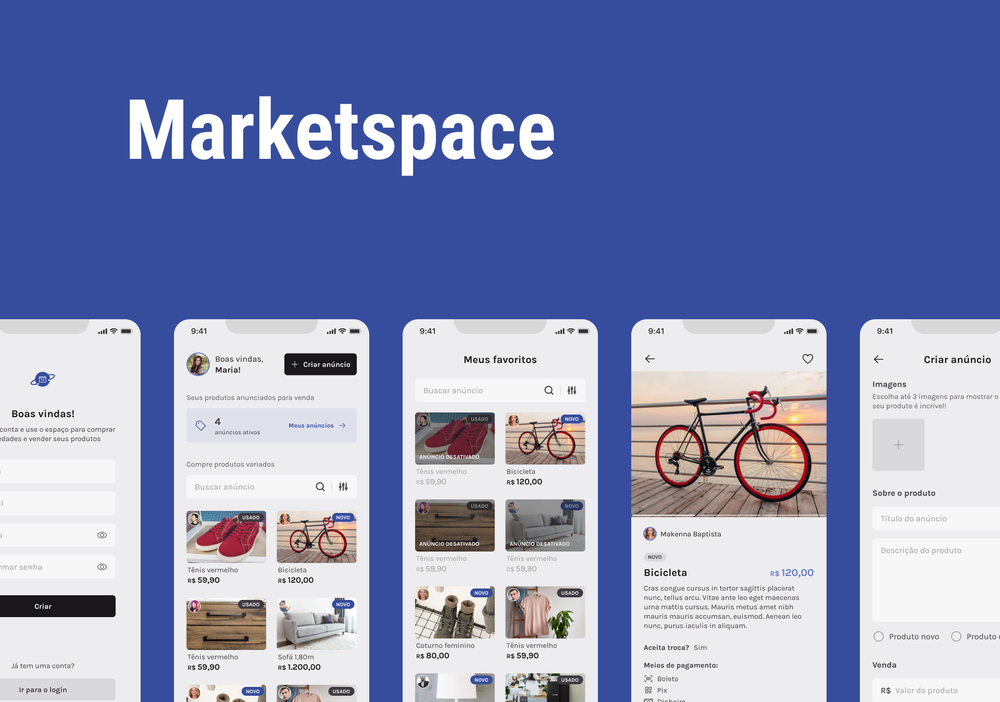

# Marketspace

A Marketspace made with React Native for mobile and Golang in the backend.

Technologies used:
- Expo 48.0.15
- React Native 0.71.7
- React Navigation 6.1.6
- React Hook Form 7.45.0
- Zod 3.21.4
- React Native Async Storage 1.17.11

And the Context Api is also used to manage state between some screens as well as maintain some user information. Async storage, on the other hand, is used to store the token, because if the user reloads the application or even if it closes, it will still keep the token responsible for authenticating the user in the api.